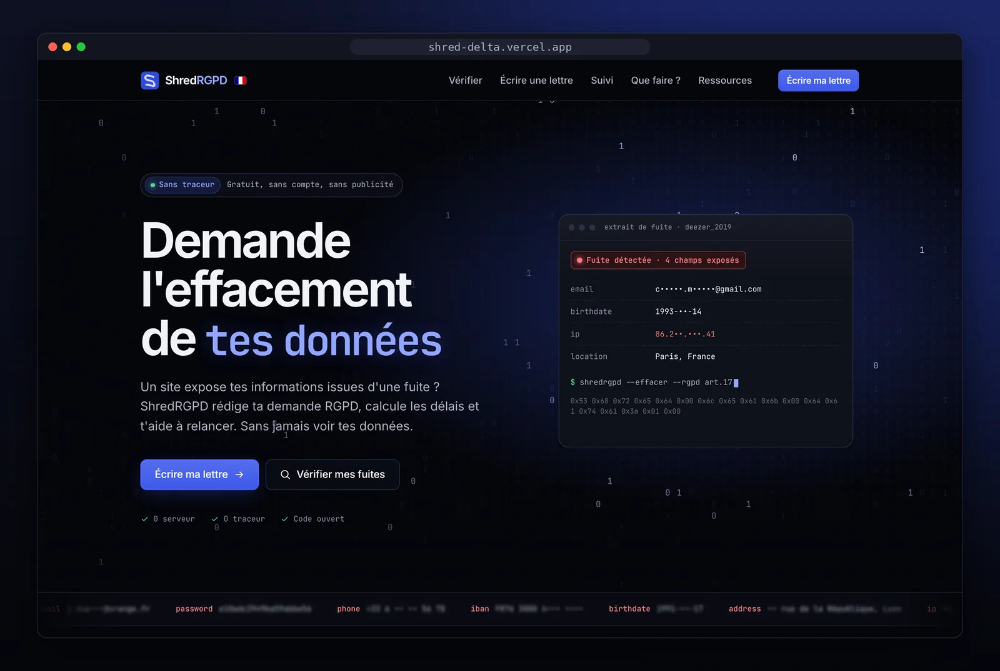
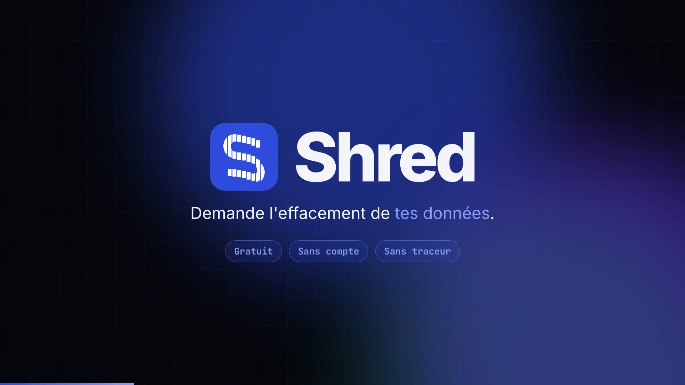
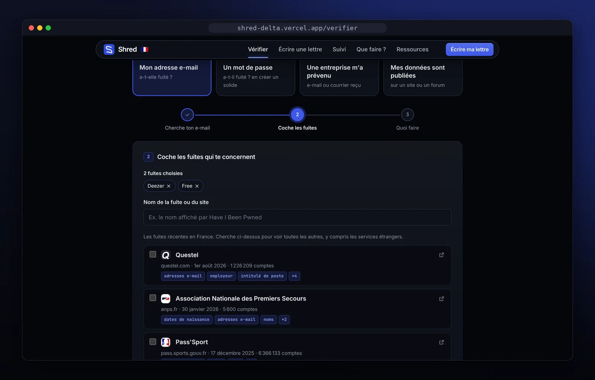
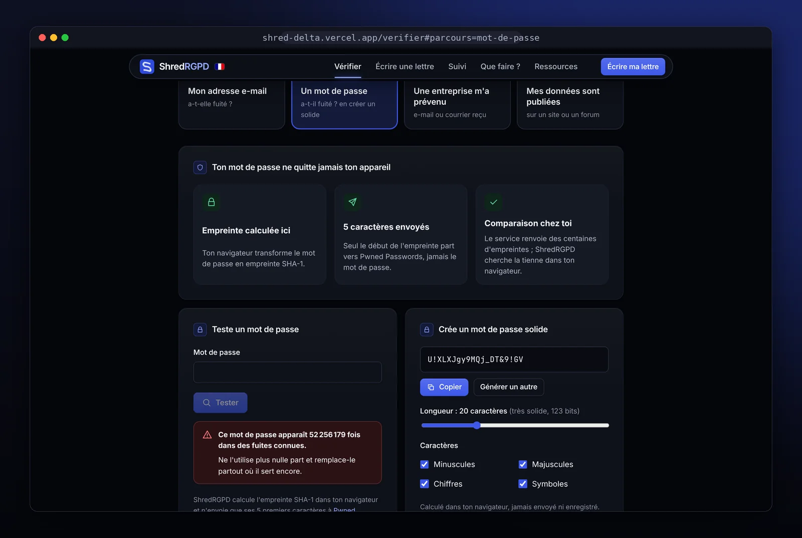
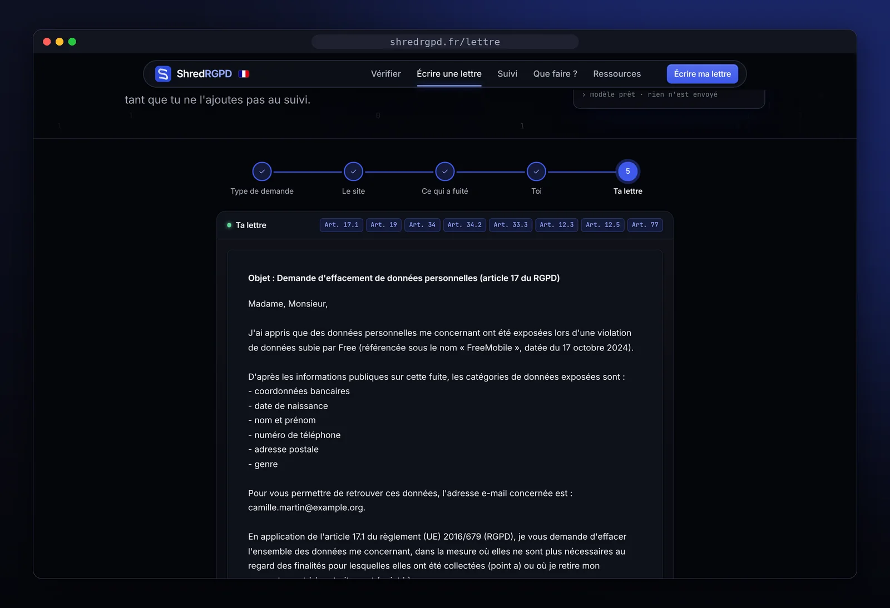
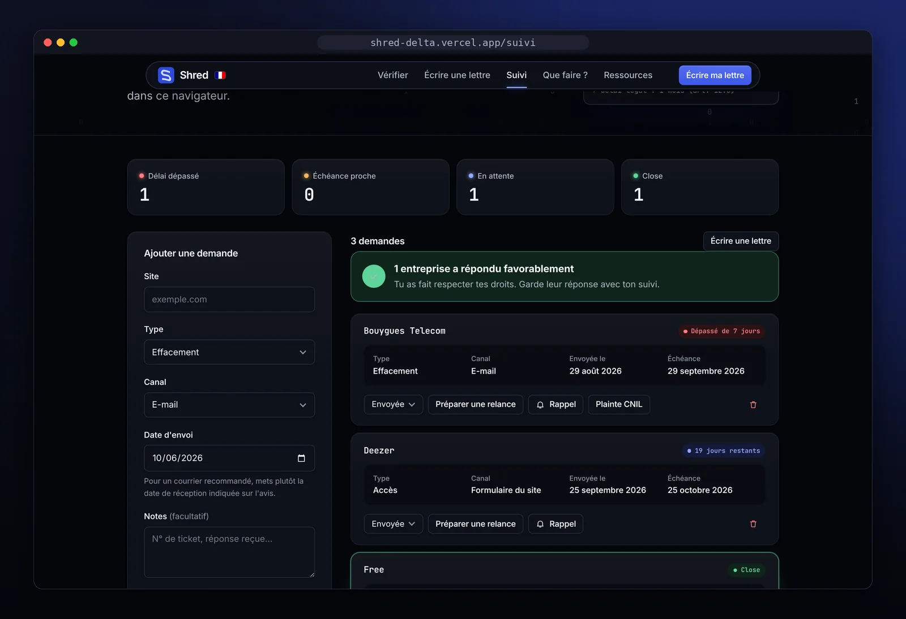
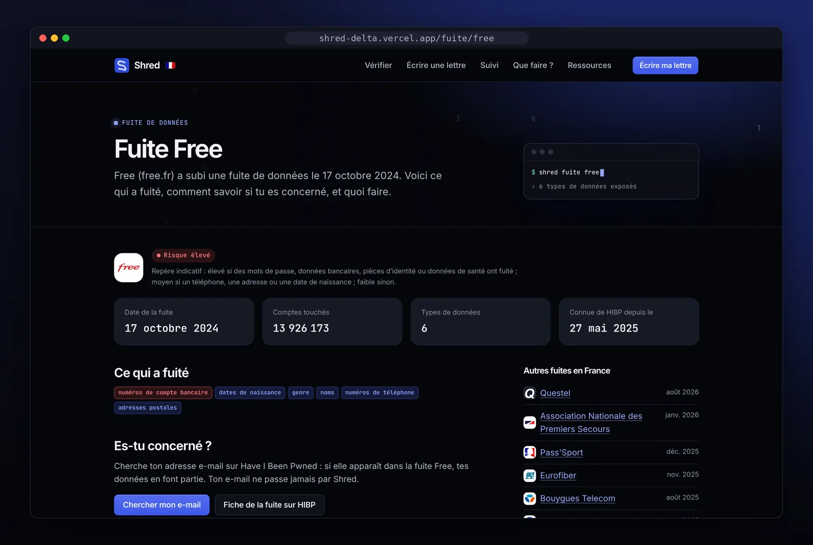

<div align="center">


# Shred

**Tes données ont fuité ? Demande leur effacement.**

Un outil gratuit, en français, pour voir ce qui a fuité et écrire à l'entreprise une lettre RGPD en quelques minutes.
Sans compte, sans traceur : tes données restent dans ton navigateur.

[**Ouvrir Shred →**](https://shred-delta.vercel.app)

[](https://github.com/chadi-shwada/shred/actions/workflows/ci.yml)
[](LICENSE)
[](https://shred-delta.vercel.app)
[](#vie-privée)



</div>

## Pourquoi Shred

Free, Deezer, Bouygues Telecom… Quand une entreprise se fait voler les données de ses clients, le RGPD te donne des droits : savoir ce qu'elle détient sur toi, faire effacer tes données, obtenir une réponse sous un mois. Encore faut-il savoir à qui écrire, quoi demander et quels articles citer.

Shred s'occupe de tout ça :

1. **Vérifier** ce qui a fuité, à partir des fuites connues ;
2. **Écrire** une lettre RGPD pré-remplie, avec les bons articles ;
3. **Suivre** le délai légal, puis relancer et préparer une plainte à la CNIL si besoin.

> Les lettres sont des modèles indicatifs, pas un conseil juridique.

<p align="center">
  <a href="https://shred-delta.vercel.app/videos/shred-presentation.mp4">
    
  </a>
  <br>
  <sub>Shred en 45 secondes (vidéo sans son, sous-titres sur le site)</sub>
</p>

## Ce que tu peux faire

### Vérifier ce qui a fuité

Cherche ton adresse e-mail sur [Have I Been Pwned](https://haveibeenpwned.com), puis colle la page de résultats dans Shred : les fuites sont reconnues et cochées d'un coup. Le texte collé est effacé dès l'analyse, il ne quitte jamais ton navigateur.

Tu peux aussi partir d'un message reçu d'une entreprise, ou de données publiées sur un site. Pour chaque fuite, Shred affiche les données exposées, un niveau de risque et un plan d'action à cocher.

<p align="center"></p>

### Tester un mot de passe sans le confier

Le test utilise le service Pwned Passwords par **k-anonymat** :
- ton navigateur calcule l'empreinte SHA-1 du mot de passe ;
- il n'envoie que ses 5 premiers caractères ;
- la comparaison se fait chez toi.

Un générateur de mots de passe solides est inclus. Il repose sur `crypto.getRandomValues`, avec un tirage sans biais.

<p align="center"></p>

### Écrire ta lettre RGPD

Un générateur en 5 étapes : type de demande, site, ce qui a fuité, toi, ta lettre. Depuis une fuite, la lettre arrive pré-remplie avec le nom de l'entreprise, la date de la fuite et les données exposées.

| Demande | Articles cités |
| --- | --- |
| Effacement | RGPD art. 17, 19, 12.3 |
| Accès à tes données | art. 15, 12.3 |
| Opposition | art. 21, 17.1 c, 15.1 g |
| Fermeture de compte | art. 17.1 a/b, 7.3 |
| Relance | art. 12.3, 12.4, 77 |
| Signalement à l'hébergeur | art. 16 du DSA |

Deux contextes sont pris en compte : l'entreprise a subi la fuite (art. 34, 34.2, 33.3), ou un site publie des données issues d'une fuite (art. 17.1 d, 17.2). Ensuite, tu peux copier la lettre, l'envoyer par e-mail, la télécharger ou l'imprimer.

<p align="center"></p>

### Suivre tes demandes

Le suivi calcule l'échéance légale : un mois, ou trois si l'entreprise prolonge. Il signale les délais dépassés et prépare la relance. Il propose aussi :
- un rappel à ajouter à ton agenda (`.ics`) ;
- un dossier de plainte CNIL prêt à envoyer ;
- l'export et l'import en JSON.

Tout reste dans le stockage local de ton navigateur.

<p align="center"></p>

### Une page par fuite française

Chaque fuite française a sa page, par exemple [`/fuite/free`](https://shred-delta.vercel.app/fuite/free). On y trouve :
- ce qui a fuité ;
- comment savoir si tu es concerné ;
- quoi faire ;
- une lettre pré-remplie ;
- une image de partage avec le logo de l'entreprise.

Un [flux RSS](https://shred-delta.vercel.app/fuites.xml) annonce les nouvelles fuites. La liste se met à jour chaque jour.

<p align="center"></p>

### Sur mobile aussi

<p align="center"></p>

## Vie privée

Shred est un site statique : il n'a pas de serveur à lui, et donc rien où stocker tes données.

- **Aucune donnée personnelle ne quitte ton navigateur.** Pas de compte, pas de cookie, pas de mesure d'audience, pas de police ni de script chargés depuis un autre site.
- **Ton e-mail ne passe jamais par Shred.** La recherche se fait sur Have I Been Pwned, que tu ouvres toi-même.
- **Une seule requête externe, et seulement à ta demande** : le test de mot de passe vers `api.pwnedpasswords.com`, qui ne reçoit que 5 caractères de l'empreinte. La politique de sécurité du contenu (CSP) bloque toute autre connexion.
- **Aucune base de fuites.** Shred n'embarque que les métadonnées publiques du catalogue Have I Been Pwned (nom, date, types de données), jamais les données fuitées.
- Les paramètres d'une lettre pré-remplie passent dans la partie de l'adresse après `#`, que le navigateur n'envoie pas au serveur.

## Comment c'est fait

- **React 19, TypeScript et Vite 8**, sans framework serveur. Le build produit une page HTML par adresse et par fuite, plus le plan du site et le flux Atom.
- **Catalogue des fuites** : téléchargé au build depuis l'[API publique de Have I Been Pwned](https://haveibeenpwned.com/API/v3#AllBreaches), avec les logos des entreprises. Une heuristique repère les fuites françaises : domaine en `.fr`, mention de la France dans la description, ou courte liste d'entreprises connues.
- **Mise à jour quotidienne** : un workflow GitHub Actions déclenche un redéploiement Vercel chaque jour.
- **Logique métier dans `src/lib/`** : TypeScript pur, sans React ni DOM, couvert par les tests (Vitest).
- **Accessibilité** : audit axe (WCAG 2.1 AA) sans erreur, focus visible, animations coupées si tu les réduis.

```text
src/
├── lib/          logique pure et testée : lettres, délais, fuites, k-anonymat…
├── pages/        Accueil, Vérifier, Lettre, Suivi, Que faire ?, pages de fuite…
├── components/   interface
├── data/         vidéos, contacts DPO et sites connus (sourcés et datés)
└── styles/       thème sombre, jetons de couleur
scripts/          téléchargement du catalogue HIBP, logos, images de partage
```

## Lancer en local

Il faut Node 22.12 ou plus récent.

```bash
git clone https://github.com/chadi-shwada/shred.git
cd shred
npm install
npm run dev
```

Avant chaque commit :

```bash
npm run typecheck && npm run lint && npm test && npm run build
```

Sans accès réseau, le build continue sans catalogue : la page Vérifier affiche alors « liste indisponible ».

## Déployer ta copie

Le site se déploie sur [Vercel](https://vercel.com) depuis la branche `main`. Toute la configuration est dans `vercel.json` :
- build `npm run build`, dossier `dist` ;
- adresses sans `.html` ;
- en-têtes de sécurité, dont la CSP.

Pour la mise à jour quotidienne de la liste des fuites, crée un *Deploy Hook* Vercel sur `main`. Ajoute ensuite son URL dans le secret GitHub `VERCEL_DEPLOY_HOOK`. Sans ce secret, le workflow ne fait rien.

Shred n'inclut volontairement ni Vercel Analytics ni Speed Insights.

## Contribuer

Tu as repéré une erreur dans une lettre, un bug, une idée ? [Ouvre une issue](https://github.com/chadi-shwada/shred/issues) ou propose une pull request.

Quelques règles du projet :
- **Ne jamais inventer un contact.** Un contact de DPO ou de responsable de traitement n'entre que s'il vient d'une source officielle, avec sa date de vérification.
- **Citer l'article.** Toute modification d'une lettre cite l'article du RGPD concerné et met à jour les tests.
- **Rien n'envoie de données à un tiers.** Pas d'analytics, pas de CDN, pas de requête externe.
- **Interface en français**, avec tutoiement ; les lettres vouvoient.

Le détail est dans [`CLAUDE.md`](CLAUDE.md).

## Crédits

- Catalogue des fuites : [Have I Been Pwned](https://haveibeenpwned.com), sous licence [CC BY 4.0](https://creativecommons.org/licenses/by/4.0/).
- Test de mot de passe : [Pwned Passwords](https://haveibeenpwned.com/Passwords).
- Polices [Inter](https://rsms.me/inter/) et [JetBrains Mono](https://www.jetbrains.com/lp/mono/), sous licence SIL OFL, hébergées par le site.
- Les logos des entreprises sont des marques de leurs propriétaires, sans lien avec Shred.

## Licence

[MIT](LICENSE). Les modèles de lettres sont fournis à titre indicatif et ne constituent pas un conseil juridique.
